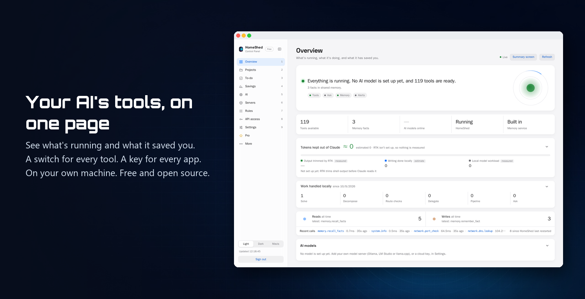
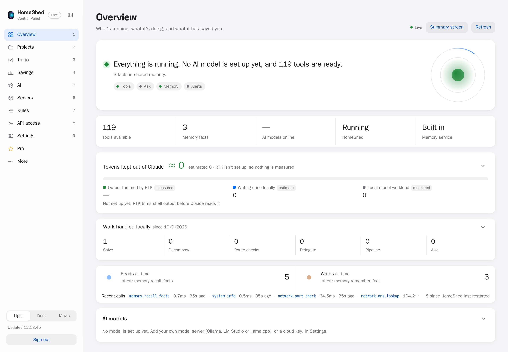
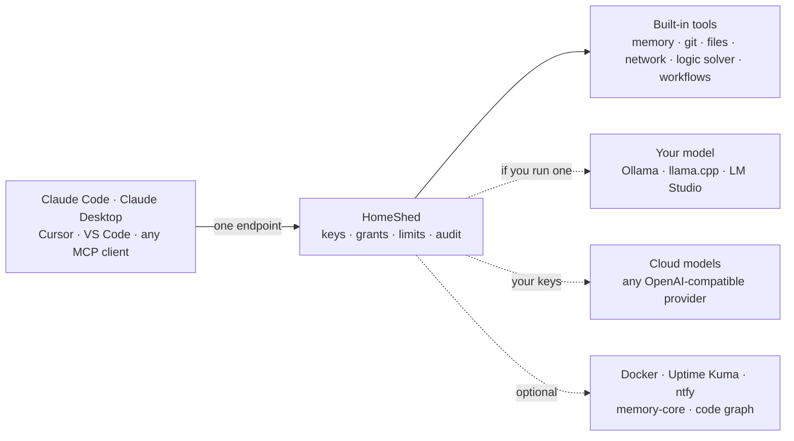

<!--
  Generated blocks (never edit by hand; CI fails if stale):
    INSTALL  → python scripts/gen_install.py --package homeshed-mcp
    TOOLS    → python scripts/gen_tools_table.py
-->


<p align="center">
  
</p>
<!-- mcp-name: io.github.keefng8/homeshed-mcp -->

<h3 align="center">Every tool your AI needs, in one install: memory, reasoning, git, Docker and more.</h3>

<p align="center">
  A self-hosted MCP server for Claude Code, Claude Desktop, Cursor, VS Code, OpenCode and any MCP client.<br>
  Your model first, the cloud when you choose.
</p>

<p align="center">
  <a href="https://github.com/keefng8/homeshed-mcp/actions/workflows/ci.yml"></a>
  <a href="https://pypi.org/project/homeshed-mcp/"></a>
  <a href="LICENSE"></a>
  
  <a href="https://modelcontextprotocol.io"></a>
</p>

<p align="center">
  <a href="#install">Install</a> ·
  <a href="#what-your-ai-can-do">What your AI can do</a> ·
  <a href="#tools">All tools</a> ·
  <a href="#security">Security</a> ·
  <a href="#how-it-compares">Compare</a> ·
  <a href="#roadmap">Roadmap</a> ·
  <a href="#homeshed-pro">Pro</a> ·
  <a href="#faq">FAQ</a>
</p>

---

**HomeShed** is a self-hosted [Model Context Protocol](https://modelcontextprotocol.io) tool server. Add it to your
AI assistant and it can check your containers, work with git, remember what it learned across sessions, spot bugs
it has seen before, and solve logic problems: <!--count:total-->119<!--/count--> tools behind one endpoint that you run and control.

<p align="center">
  
</p>
<p align="center"><sub>The optional Control Panel on a fresh install. HomeShed itself runs without it.</sub></p>

## Why people use it

**Free and open source (Apache-2.0).** One install, <!--count:total-->119<!--/count--> tools, no account, no GPU.

- **Memory that carries across sessions.** Your AI remembers facts, decisions and fixes between conversations and
  across projects. It's built in, with nothing extra to run. Facts are kept by category and recalled by relevance
  to the task in hand, and in Claude Code each project gets its own memory automatically.
- **Finds the API keys your AI has already seen.** Claude Code keeps every conversation on disk as plain text,
  including any key that was pasted or printed. HomeShed checks those files and tells you which kinds of key are
  there, where, and where to rotate them, without showing the keys themselves.
- **Reasoning where language models slip.** A logic and constraint solver (Z3) handles the puzzles models get
  wrong, big tasks break into steps, and a router says when a task needs a frontier model and when a smaller one
  will do.
- **Your model first, the cloud when you choose.** Routine work like drafts and summaries can go to a model you
  run (Ollama, llama.cpp, LM Studio) or to cloud keys you bring. HomeShed doesn't include a model or need a GPU.
- **Ready-to-publish checks for your own projects.** What a professional repository needs, private details and
  secrets caught before they go public, docs checked against the code, and a progress score. They're the checks
  used to prepare this release.
- **Mistakes that stay fixed.** Your AI logs corrections and broken rules as observations, repeats get flagged, and a
  known-bugs list answers "has this error been seen before?"
- **Checks before your AI acts.** Rule packs check each command and file write before Claude Code runs it, and stop
  risky ones with the reason and what to do instead. Write your own in a few lines of JSON, or add
  [HomeShed Pro](#homeshed-pro)'s curated packs ([how](docs/rule-packs.md)).
- **A Control Panel, if you want one.** An optional web page on your own machine shows what's running and what it has
  saved you, with a switch for every tool and a key for every app. Add it any time; HomeShed never needs it.
- **One endpoint, you stay in control.** Every app gets its own key, tool list and rate limit, and every change to
  them is logged. Tools that act on your machines start off, and keys sit in an encrypted vault that's never shown
  to the AI.

## Install

A real run, from setup to the first answers:

<p align="center">
  
</p>

<!-- INSTALL:START (generated by scripts/gen_install.py; do not edit by hand) -->
Three steps. No accounts, no keys, no GPU.

**1. Install `uv`** (the tool that runs homeshed-mcp; once per computer). Open a terminal (Windows: press Start, type
**PowerShell**, press Enter; macOS: open **Terminal**) and paste:

| Windows (PowerShell) | macOS / Linux |
|---|---|
| `powershell -ExecutionPolicy ByPass -c "irm https://astral.sh/uv/install.ps1 \| iex"` | `curl -LsSf https://astral.sh/uv/install.sh \| sh` |

Then **close the terminal and open a new one**, so it can find `uv`. `uvx --version` prints a version number when it's
ready.

**2. Add it to your AI app.** For Claude Code (already installed), one command finds a local model if you run one,
lists the optional tool groups (the ones it finds are ticked: press Enter to keep them), then asks before adding
HomeShed (answer **Y**):

```bash
uvx homeshed-mcp setup
```

For Cursor, VS Code or Claude Desktop, click the button for your app (Claude Desktop's downloads `homeshed-mcp.mcpb`:
double-click that file). Or add it to Claude Code yourself:

<p>
  <a href="https://cursor.com/en/install-mcp?name=homeshed-mcp&config=eyJjb21tYW5kIjoidXZ4IiwiYXJncyI6WyJob21lc2hlZC1tY3AiXX0%3D"></a>
  <a href="https://insiders.vscode.dev/redirect/mcp/install?name=homeshed-mcp&config=%7B%22type%22%3A%22stdio%22%2C%22command%22%3A%22uvx%22%2C%22args%22%3A%5B%22homeshed-mcp%22%5D%7D"></a>
  <a href="https://insiders.vscode.dev/redirect/mcp/install?name=homeshed-mcp&config=%7B%22type%22%3A%22stdio%22%2C%22command%22%3A%22uvx%22%2C%22args%22%3A%5B%22homeshed-mcp%22%5D%7D&quality=insiders"></a>
  <a href="https://github.com/keefng8/homeshed-mcp/releases/latest/download/homeshed-mcp.mcpb"></a>
</p>

```bash
claude mcp add -s user homeshed-mcp -- uvx homeshed-mcp
```

**3. Quit your app fully, open it again, and try it in its chat** (Windows: right-click its icon by the clock and
choose Quit; macOS: Cmd+Q; Cursor and VS Code: use agent mode). These work straight away, with nothing else set up:

- *"What tools do you have from homeshed-mcp?"*
- *"What are github.com's IP addresses?"*
- *"Is port 443 open on example.com?"*
- *"Use the logic solver: which whole numbers x and y give x + y = 10 and x − y = 4?"*
- *"What operating system and CPU is this machine running?"*

Stuck? If the terminal says `uvx` isn't recognised or not found, open a new terminal and try again. Then run
`uvx homeshed-mcp doctor`: it checks everything and gives you the exact command to fix anything that's missing. If your app
can't start `uvx` (common for apps opened from the macOS Dock), put the full path that `which uvx` prints into its MCP
settings in place of `uvx`.

<details><summary><b>Other apps and install methods</b> (Codex, Gemini CLI, Claude Desktop, Windsurf, Cline, Zed, OpenCode, Goose, pip)</summary>

#### One-line commands

| Client | Command |
|---|---|
| Codex CLI | `codex mcp add homeshed-mcp -- uvx homeshed-mcp` |
| Gemini CLI | `gemini mcp add homeshed-mcp uvx homeshed-mcp` |
| VS Code | `code --add-mcp '{"name":"homeshed-mcp","command":"uvx","args":["homeshed-mcp"]}'` |
| Run it directly | `uvx homeshed-mcp` · `pipx run homeshed-mcp` · `pip install homeshed-mcp && homeshed-mcp` (in a virtual environment) |

#### Claude Desktop

Easiest: download `homeshed-mcp.mcpb` from the [latest release](https://github.com/keefng8/homeshed-mcp/releases/latest) and
double-click it. Or add this to `claude_desktop_config.json` (Settings → Developer → Edit Config):

```json
{
  "mcpServers": {
    "homeshed-mcp": {
      "command": "uvx",
      "args": [
        "homeshed-mcp"
      ]
    }
  }
}
```

The same `mcpServers` block works in **Cursor** (`~/.cursor/mcp.json`), **Windsurf**
(`~/.codeium/windsurf/mcp_config.json`) and **Cline** (MCP Servers → Configure).

#### VS Code (`.vscode/mcp.json`)

```json
{
  "servers": {
    "homeshed-mcp": {
      "type": "stdio",
      "command": "uvx",
      "args": [
        "homeshed-mcp"
      ]
    }
  }
}
```

#### Zed (`settings.json`)

```json
{
  "context_servers": {
    "homeshed-mcp": {
      "source": "custom",
      "command": "uvx",
      "args": [
        "homeshed-mcp"
      ]
    }
  }
}
```

#### OpenCode (`opencode.json`)

```json
{
  "mcp": {
    "homeshed-mcp": {
      "type": "local",
      "command": [
        "uvx",
        "homeshed-mcp"
      ],
      "enabled": true
    }
  }
}
```

#### Goose (`~/.config/goose/config.yaml`; on Windows `%APPDATA%\Block\goose\config\config.yaml`)

```yaml
extensions:
  homeshed-mcp:
    type: stdio
    name: homeshed-mcp
    enabled: true
    cmd: uvx
    args: [homeshed-mcp]
    timeout: 300
```

#### Codex (`~/.codex/config.toml`)

```toml
[mcp_servers.homeshed-mcp]
command = "uvx"
args = ["homeshed-mcp"]
```

No `uv` yet? [Install it](https://docs.astral.sh/uv/getting-started/installation/) with one command.
</details>

<details><summary><b>Want more? Connect your own model, cloud keys, or switch on write tools</b></summary>

Pass settings as environment variables, for example with `-e` in `claude mcp add`:

```bash
claude mcp add -s user homeshed-mcp -e LOCAL_AI_BASE_URL=http://localhost:11434/v1 -- uvx homeshed-mcp
```

| Setting | What it does |
|---|---|
| `LOCAL_AI_BASE_URL` | Your OpenAI-compatible model server (Ollama, llama.cpp, LM Studio…) |
| `LOCAL_AI_MODEL` | Which model on that server to use (needed with `LOCAL_AI_BASE_URL`; `setup` prints both) |
| `NVIDIA_API_KEY`, `GROQ_API_KEY`, `OPENROUTER_API_KEY`, `MISTRAL_API_KEY`, `GEMINI_API_KEY`, `OVH_AI_ENDPOINTS_TOKEN` | Cloud providers you choose to use, with your own keys ([all settings](docs/configuration.md)) |
| `ENABLE_TOOLS` | Switch on write tools, e.g. `git.commit,git.push` or a whole group, `git.*` (`dev.*` runs code: opt in only if you mean it) |
| `DATA_DIR`, `MEMORY_DB_PATH` | Where it keeps its data and memory |

> **Keep keys out of config files.** A key passed with `-e` is saved in plain text in that client's config. Where
> your client supports it, point at an environment variable instead, and never commit a config that holds a key.
</details>
<!-- INSTALL:END -->

**New to terminals?** Follow the [step-by-step guide](docs/getting-started.md): every step explained, with what you
should see after each one.

### Run it as a server for all your apps (Docker)

Run it once and connect every assistant, agent and machine to it, each with its own key, grants and limits.

On the server (it needs Docker, and `uv` from step 1 above):

```bash
git clone https://github.com/keefng8/homeshed-mcp.git && cd homeshed-mcp
uvx homeshed-mcp init               # writes .env here (token, vault key, allowed hosts) and prints your owner token once
docker compose up -d                 # listens on 127.0.0.1:8765
```

Then, on the machine where your AI app runs (the same machine here):

```bash
claude mcp add -s user --transport http homeshed-mcp http://127.0.0.1:8765/mcp --header "Authorization: Bearer YOUR_TOKEN"
```
Replace `YOUR_TOKEN` with the token `init` printed. The server keeps its copy in `.env` (git ignores it; back it up,
since `init` shows the token only once). On the app's side, keep the token in an environment variable rather than a
file you might share: to share the setup with a team, commit a `.mcp.json` that names the variable
(`"Authorization": "Bearer ${MCP_TOKEN}"`), never the token itself. To connect from other machines, see
[configuration](docs/configuration.md#http-and-docker).

### Add the Control Panel (optional)

A web page for your install, on your own machine: see at a glance what's running and what it has saved you, switch any
tool off, give each app its own key, and keep your keys encrypted in one place. HomeShed never needs it. Add it now,
later, or not at all, and remove it without touching HomeShed.

<p align="center">
  
</p>

| Page | What you get |
|---|---|
| **Overview** | Is everything working? What your AI just did, who's connected, and what your setup has saved |
| **Models and Reasoning** | Which AI answers first and why; try the logic solver and the other reasoning tools by hand |
| **Tools** | Every tool, how often it's used, and an on/off switch for each |
| **API access** | A key for each app or agent, with only the tools you grant, a rate limit and an expiry |
| **Keys and passwords** | Stored encrypted by HomeShed; your AI uses them without ever seeing them |
| **Containers, Uptime, Savings** | Your Docker containers, your Uptime Kuma checks, and the tokens kept out of your AI's context, once you use them |

With Docker, in the HomeShed folder:

```bash
docker compose --profile panel up -d
docker compose logs panel            # the first-run password, printed once
```

Without Docker, in the folder where you ran `uvx homeshed-mcp init`:

```bash
uvx homeshed-mcp serve --http                         # HomeShed as a server; leave it running
uvx --from "homeshed-mcp[panel]" homeshed-mcp panel   # in a second terminal
```

Then open http://127.0.0.1:9090 and sign in. The panel answers on this machine only and always asks for a password.
Every page says **Not set up yet**, and what it needs, for anything you haven't added. More:
[the panel's README](panel/README.md) and its [page-by-page guide](panel/guides/control-panel.md).

## What your AI can do



| Area | Works out of the box | Connects to what you already run |
|---|---|---|
| **Reasoning** | Logic and constraint solving (Z3), task routing, complexity scoring | Break down, delegate and run tasks on your model |
| **AI** | | Ask your model, or cloud models with keys you bring |
| **Memory** | Facts by category, relevance-ranked recall, a memory per project | A self-hosted memory-core instead of the built-in store |
| **Code & git** | Status, diff; commit, push, pull, clone, branch (off until you enable them); find dead Python files; catch webhooks that lose retries; six silent Strapi bugs | Build, lint and test runners (off, opt-in) |
| **Machines** | System info and health, DNS lookup, port checks, file listings | Docker containers, Uptime Kuma, ntfy notifications; check your own public sites for exposed admin pages, `/.env` and `/.git` |
| **Knowledge** | A known-bugs list: "has this error been seen before?"; find API keys left in your Claude Code history, and where to rotate them | Code-graph questions (graphify) |
| **Publishing** | Is a repo ready for GitHub (with a fix per gap); do the docs match the code; private details and secrets before you publish; release progress an agent reports | |
| **Glue** | Chain tools into one workflow; find the right tool from plain English | |

## Tools

<!-- TOOLS:START (generated by scripts/gen_tools_table.py; do not edit by hand) -->
**119 tools** in 31 groups. `write` tools change something; 🔒 = off until you enable it (see [Security](#security)).

<details><summary><b>apis</b> (2)</summary>

| Tool | What it does | Risk | Needs |
|---|---|---|---|
| `apis.find` | Find APIs in the shared catalog by need, e.g. 'text to speech' or 'free web search'. | read | nothing |
| `apis.list` | List APIs in the shared catalog (what APIs exist, cost, local vs cloud, status, how to use), filtered by category/cost/local/status. Never contains secrets. | read | nothing |

</details>

<details><summary><b>bugs</b> (5)</summary>

| Tool | What it does | Risk | Needs |
|---|---|---|---|
| `bugs.export` | Export the public known bugs as a shareable feed, cleaned of secrets, private addresses and user folders. | read | nothing |
| `bugs.find` | Has this error been seen before? Paste it and get the known cause and fix. | read | nothing |
| `bugs.list` | List known bugs, newest first, by status or component. | read | nothing |
| `bugs.report` | Record a known bug (or a new occurrence of one) with its cause and fix, so nobody hits it twice. | write | nothing |
| `bugs.sync` | Fetch the HomeShed Pro known-bugs feed with this install's Pro key and merge it in, so bugs.find knows every fix Pro members get. | write | a Pro key (Settings > Pro membership) |

</details>

<details><summary><b>code</b> (2)</summary>

| Tool | What it does | Risk | Needs |
|---|---|---|---|
| `code.dead_scan` | Walk a Python project's import graph from its real entry points: files nothing reaches, and __init__.py re-exports nothing uses (delete-with-care). | read | nothing |
| `code.webhook_retry_check` | Find webhook handlers whose catch block swallows the error and answers 200, so the sender (PayPal, Stripe) never retries. | read | nothing |

</details>

<details><summary><b>commerce</b> (1)</summary>

| Tool | What it does | Risk | Needs |
|---|---|---|---|
| `commerce.requests.list` | An app's own shop requests (Printify publishes, live-product updates, Etsy listing edits): what still waits for the owner, and the owner's decisions of the last 7 days (approved, declined, expired), with notes. Check this instead of assuming something still waits. | read | nothing |

</details>

<details><summary><b>dev</b> (5)</summary>

| Tool | What it does | Risk | Needs |
|---|---|---|---|
| `dev.build` | Run a build command on the machine HomeShed runs on (your computer, or its container). Real code execution, no confirmation step. The toolchain must be installed there. | write 🔒 | nothing |
| `dev.lint` | Run a lint or code-quality command on the machine HomeShed runs on (your computer, or its container). Real code execution, no confirmation step. The linter must be installed there. | write 🔒 | nothing |
| `dev.node` | Run a Node.js command on the machine HomeShed runs on (your computer, or its container). Real code execution, no confirmation step. Node must be installed there; the Docker image doesn't include it. | write 🔒 | node on PATH |
| `dev.python` | Run a Python command on the machine HomeShed runs on (your computer, or its container). Real code execution, no confirmation step. | write 🔒 | nothing |
| `dev.test` | Run a test-suite command on the machine HomeShed runs on (your computer, or its container). Real code execution, no confirmation step. The test runner must be installed there. | write 🔒 | nothing |

</details>

<details><summary><b>docker</b> (8)</summary>

| Tool | What it does | Risk | Needs |
|---|---|---|---|
| `docker.container.inspect` | Inspect a container's config, networking and mounts. Env values withheld by default. | read | Docker socket |
| `docker.container.list` | List containers on the target Docker host, running or all. | read | Docker socket |
| `docker.container.logs` | Fetch recent log lines from a container. | read | Docker socket |
| `docker.container.restart` | Restart a container. dry_run defaults true and IS the confirmation step. | write 🔒 | Docker socket |
| `docker.container.start` | Start a stopped container. dry_run defaults true and IS the confirmation step. | write 🔒 | Docker socket |
| `docker.container.stop` | Stop a container. dry_run defaults true and IS the confirmation step. | write 🔒 | Docker socket |
| `docker.network.list` | List Docker networks on this host, including which containers are attached to each. | read | Docker socket |
| `docker.volume.list` | List Docker volumes on this host: name, driver, mountpoint, creation time. | read | Docker socket |

</details>

<details><summary><b>etsy</b> (8)</summary>

| Tool | What it does | Risk | Needs |
|---|---|---|---|
| `etsy.listing.deactivate` | Take one of the shop's active Etsy listings off sale at once (a brake for a listing that fails a check). No approval step: its own switch, a daily cap, audited, and the owner gets a push with the reason. Etsy's Shop Manager re-activates it. | write | the owner's commerce_etsy_enabled and commerce_etsy_deactivate_enabled switches, an Etsy connection made with listing edits (listings_w) |
| `etsy.listing.get` | One Etsy listing in detail: title, description, price, tags, materials, views, favourites. Read-only. | read | the owner's commerce_etsy_enabled switch, Etsy app and shop credentials (ETSY_KEYSTRING, ETSY_SHARED_SECRET, ETSY_REFRESH_TOKEN, ETSY_SHOP_ID) |
| `etsy.listing.update` | Ask to set an Etsy listing's category, materials, production partners, delivery profile, attributes (colour, occasion, recipient, holiday) and extra photos (up to 5 at a time, shown to the owner as thumbnails). Nothing changes until the owner approves it; only what differs is sent; details (not photos) are re-queued after a Printify re-publish. | write | the owner's commerce_etsy_enabled and commerce_etsy_write_enabled switches, an Etsy connection made with listing edits (listings_w), the owner's approval of each change |
| `etsy.listings.list` | The Etsy shop's listings, compact and paged: id, title, state, price, quantity. Read-only. | read | the owner's commerce_etsy_enabled switch, Etsy app and shop credentials (ETSY_KEYSTRING, ETSY_SHARED_SECRET, ETSY_REFRESH_TOKEN, ETSY_SHOP_ID) |
| `etsy.order.get` | One Etsy order: status, money, items and shipments; no buyer personal details. Read-only. | read | the owner's commerce_etsy_enabled switch, Etsy app and shop credentials (ETSY_KEYSTRING, ETSY_SHARED_SECRET, ETSY_REFRESH_TOKEN, ETSY_SHOP_ID) |
| `etsy.orders.list` | The Etsy shop's orders (receipts), compact and paged; no buyer names, emails or addresses. Read-only. | read | the owner's commerce_etsy_enabled switch, Etsy app and shop credentials (ETSY_KEYSTRING, ETSY_SHARED_SECRET, ETSY_REFRESH_TOKEN, ETSY_SHOP_ID) |
| `etsy.shipping_destinations` | Where one of the shop's delivery profiles delivers: countries or regions, prices, delivery days, and whether any is in the EU. | read | the owner's commerce_etsy_enabled switch, Etsy app and shop credentials (ETSY_KEYSTRING, ETSY_SHARED_SECRET, ETSY_REFRESH_TOKEN, ETSY_SHOP_ID) |
| `etsy.shop.get` | The configured Etsy shop: name, currency, listing and sales counts, reviews, vacation mode. Read-only, proxied (the app never holds the key). | read | the owner's commerce_etsy_enabled switch, Etsy app and shop credentials (ETSY_KEYSTRING, ETSY_SHARED_SECRET, ETSY_REFRESH_TOKEN, ETSY_SHOP_ID) |

</details>

<details><summary><b>files</b> (1)</summary>

| Tool | What it does | Risk | Needs |
|---|---|---|---|
| `files.list` | List a directory's entries, ls -F style by default ("docs/", "notes.txt (1.2 KB)"); detail=full gives type, size, modified time and permissions. At most 100 unless limit says otherwise, with total and more telling what was left out. Metadata only, never file content. | read | nothing |

</details>

<details><summary><b>git</b> (7)</summary>

| Tool | What it does | Risk | Needs |
|---|---|---|---|
| `git.branch` | Create and/or switch to a git branch. Fully autonomous, no confirmation step. | write 🔒 | nothing |
| `git.clone` | Clone a git repository. Fully autonomous, no confirmation step. | write 🔒 | nothing |
| `git.commit` | Stage and create a git commit. Fully autonomous, no confirmation step. | write 🔒 | nothing |
| `git.diff` | Unified diff for working-tree or staged changes in a git repository. | read | nothing |
| `git.pull` | Pull changes into the current branch. Fully autonomous, no confirmation step. | write 🔒 | nothing |
| `git.push` | Push the current branch to a remote. Fully autonomous, no confirmation step. | write 🔒 | nothing |
| `git.status` | Branch, ahead/behind tracking, and staged/unstaged/untracked files for a git repository. | read | nothing |

</details>

<details><summary><b>graphify</b> (1)</summary>

| Tool | What it does | Risk | Needs |
|---|---|---|---|
| `graphify.query` | Ask an already-generated graphify code graph a question via BFS/DFS traversal. Locator, not an answerer — returns src= paths to read, not final answers. | read | graphify, and a graph built for the project |

</details>

<details><summary><b>image</b> (10)</summary>

| Tool | What it does | Risk | Needs |
|---|---|---|---|
| `image.carousel` | Designs as 1080x1350 (4:5) or 1080x1920 (9:16) social slides on their own background, saved in the images promo folder for threads.publish. | write | the local image service |
| `image.generate` | Start an image generation job; returns a job_id immediately. Default: free local GPU (stable-diffusion.cpp), whose default model Qwen-Image-2.1 is NON-COMMERCIAL. Opt-in PAID providers (openai, stability, replicate, fal, together, xai) via provider=..., IMAGE_DEFAULT_PROVIDER, or require_commercial=true, which refuses models whose outputs can't be sold. | write | GPU image service (IMAGE_BASE_URL) for local-sdcpp, a provider API key in the vault for a paid provider |
| `image.history` | Recent generated images with the prompt each was made with, the model, seed and size, newest first: local and paid-provider images together. Read-only, no image data. | read | GPU image service (IMAGE_BASE_URL) for local images |
| `image.print_file` | Turn a design on a plain background into transparent print files at a print area's exact size (300 DPI, full colour or flat colours), light-tee and dark-tee (keyline) versions. | write | GPU image service (IMAGE_BASE_URL) for local jobs |
| `image.promo_card` | A branded 1080x1920 (9:16) or 1080x1350 (4:5) promo card around a real product mockup: logo, headline, benefit, real GBP price, Shop now button and link, in a bold 'drop' or premium 'editorial' template, optionally on a brand frame. Saved in the images promo folder for threads.publish. | write | the local image service, a brand kit on the image service |
| `image.prompts` | List, add, edit or remove the owner's saved image prompts (shared with the Control Panel). | write | GPU image service (IMAGE_BASE_URL) for local jobs |
| `image.providers.list` | Which image providers and models exist, whether each is switched on (owner-only switches; read-only here), configured (key stored: yes/no only), usable now (daily cap), its licence, whether outputs may be sold (commercial_use true/false/check), and cost (free local vs paid per image). | read | nothing |
| `image.queue` | The local image service's line: busy or not, the image being made and the ones waiting. | read | GPU image service (IMAGE_BASE_URL) for local jobs |
| `image.status` | Check an image generation job (local or paid provider): running/done/failed, progress, elapsed time, licence; optionally the image. | read | GPU image service (IMAGE_BASE_URL) for local jobs |
| `image.text_check` | Does a design image carry text: words, pseudo-text or a signature-like mark? Free and local (RapidOCR on the image service, ~1-2 s). Returns ok/text_found and every candidate region with its corner and score. | read | the local image service |

</details>

<details><summary><b>inbox</b> (4)</summary>

| Tool | What it does | Risk | Needs |
|---|---|---|---|
| `inbox.amend` | Correct your own open message to the owner (text, command or need); shown as edited. | write | nothing |
| `inbox.replies` | Your messages to the owner and his replies, newest first. | read | nothing |
| `inbox.send` | Leave the owner a message on the Control Panel (and his phone): a note, a command for him to run, or a decision he needs to make. | write | nothing |
| `inbox.withdraw` | Take back your own message to the owner; it leaves his list at once. | write | nothing |

</details>

<details><summary><b>llm</b> (2)</summary>

| Tool | What it does | Risk | Needs |
|---|---|---|---|
| `llm.chat` | One chat turn with a PAID language model (xAI Grok first), relayed so the caller never holds the key: the key stays in the owner's vault. Off until the owner switches the provider on and sets a daily cap (Settings > Language models); refused with the reason when off, keyless or capped. Returns text, model, usage (tokens, cost) and a truncated flag, under 5,000 characters. | write | the owner's llm_provider_xai_enabled switch and an llm_daily_cap_xai above 0, XAI_API_KEY in the vault |
| `llm.providers.list` | Which paid language-model providers llm.chat relays to and whether each is usable now: the owner's switch (read-only here), key stored (yes/no only), why not, today's request and token caps and use, today's cost (all apps and per client), and model prices. | read | nothing |

</details>

<details><summary><b>local_ai</b> (2)</summary>

| Tool | What it does | Risk | Needs |
|---|---|---|---|
| `local_ai.ask` | Ask your own model (LOCAL_AI_MODEL) a question, or a cloud model you've added a key for. Cheap local-first answers before escalating to a bigger model. | read | model server (LOCAL_AI_BASE_URL) or a cloud key |
| `local_ai.classify_complexity` | Score a request's complexity 0-100 with a fast, deterministic, offline regex heuristic. Advisory only -- never routes or executes anything. | read | nothing |

</details>

<details><summary><b>mcp</b> (1)</summary>

| Tool | What it does | Risk | Needs |
|---|---|---|---|
| `mcp.install_links` | One-click install buttons, one-line commands and per-app configs for any MCP server, from a package name or URL. | read | nothing |

</details>

<details><summary><b>memory</b> (6)</summary>

| Tool | What it does | Risk | Needs |
|---|---|---|---|
| `memory.capture` | Write a fact/decision/preference into persistent memory (the built-in store, or a self-hosted TDAI memory-core), recallable in future sessions via memory.recall. | write | nothing |
| `memory.recall` | Read back raw conversation history previously written with memory.capture for a given session_id, from the built-in store or a self-hosted TDAI memory-core. | read | nothing |
| `memory.recall_facts` | Read back one category of the project's durable facts tier — scoped, fast, no unneeded text from other categories. | read | nothing |
| `memory.recall_relevant` | Recall messages from a session ranked by relevance to a query, not just chronological order. | read | nothing |
| `memory.remember_fact` | Write a durable, high-value fact into the dedicated facts tier of persistent memory — outranks topic-scoped memory.capture entries on recall. | write | nothing |
| `memory.stats` | How much memory has been read and written: an app's own totals by category, or every app's share for the owner. | read | nothing |

</details>

<details><summary><b>network</b> (3)</summary>

| Tool | What it does | Risk | Needs |
|---|---|---|---|
| `network.dns.lookup` | Resolve a hostname to its IP addresses (A/AAAA only). | read | nothing |
| `network.exposure_check` | What your own public sites answer on the paths attackers try first: admin panels, /.env, /.git, status pages. Read-only; public hosts only. | read | internet access |
| `network.port_check` | Test TCP connectivity to a host:port -- a real connection attempt, not a guess. | read | nothing |

</details>

<details><summary><b>notify</b> (1)</summary>

| Tool | What it does | Risk | Needs |
|---|---|---|---|
| `notify.send` | Send a push notification via this deployment's self-hosted ntfy instance. | write | ntfy (NTFY_BASE_URL, NTFY_AUTH_TOKEN) |

</details>

<details><summary><b>observe</b> (3)</summary>

| Tool | What it does | Risk | Needs |
|---|---|---|---|
| `observe.list` | List observations from the persistent observation log, filtered by status and rule. | read | nothing |
| `observe.log` | Record a rule violation, user correction, or improvement gap in the persistent observation log; flags repeat violations of the same rule for escalation to a mechanical guard. | write | nothing |
| `observe.update` | Change an observation's status (actioned, declined, superseded, parked, open) and append a dated resolution note. | write | nothing |

</details>

<details><summary><b>printify</b> (16)</summary>

| Tool | What it does | Risk | Needs |
|---|---|---|---|
| `printify.blueprint.get` | One Printify blueprint (blank product): title, brand, model and its description as plain text, with the fabric, fibre and weight lines a listing's material bullet needs. Read-only. | read | the owner's commerce_printify_enabled switch, Printify token (PRINTIFY_API_TOKEN) |
| `printify.blueprints.list` | Printify's catalogue of blank products, searchable and paged. Read-only. | read | the owner's commerce_printify_enabled switch, Printify token (PRINTIFY_API_TOKEN; PRINTIFY_SHOP_ID for shop tools) |
| `printify.mockup.fetch` | Copy one of a product's Printify mockups into the image store and return its image name, for image.carousel (watermarked slides) and threads.publish. | write | the owner's commerce_printify_enabled switch, Printify token (PRINTIFY_API_TOKEN) |
| `printify.order.get` | One Printify order: status, totals, items, shipments; no delivery address. Read-only. | read | the owner's commerce_printify_enabled switch, Printify token (PRINTIFY_API_TOKEN; PRINTIFY_SHOP_ID for shop tools) |
| `printify.orders.list` | The configured Printify shop's orders, compact and paged; no delivery addresses. Read-only. | read | the owner's commerce_printify_enabled switch, Printify token (PRINTIFY_API_TOKEN; PRINTIFY_SHOP_ID for shop tools) |
| `printify.print_provider.get` | One Printify print provider (maker): city, region and country (to confirm a UK maker; print_providers.list has no location, KB-0067) and the blueprints it makes. Read-only. | read | the owner's commerce_printify_enabled switch, Printify token (PRINTIFY_API_TOKEN) |
| `printify.print_providers.list` | The print providers that make one Printify blueprint: id, title, country. Read-only. | read | the owner's commerce_printify_enabled switch, Printify token (PRINTIFY_API_TOKEN; PRINTIFY_SHOP_ID for shop tools) |
| `printify.product.create` | Upload a print file and make an UNPUBLISHED product in the owner's Printify shop (for Printify's mockups). Off until the owner switches it on; daily cap. | write | PRINTIFY_API_TOKEN with uploads.write and products.write, PRINTIFY_SHOP_ID, the owner's switches: Printify read + create |
| `printify.product.get` | One Printify product in detail: its enabled variants with price and cost (paged, or filtered to chosen variant ids), tags, blueprint, provider and where it's published. | read | the owner's commerce_printify_enabled switch, Printify token (PRINTIFY_API_TOKEN; PRINTIFY_SHOP_ID for shop tools) |
| `printify.product.publish` | Ask to publish a Printify draft to the owner's connected Etsy shop. It waits for the owner's approval in the Control Panel; only then does it go live. | write | the owner's commerce_printify_enabled and commerce_printify_publish_enabled switches, a Printify shop connected to Etsy |
| `printify.product.update` | Edit an unpublished Printify draft's title, description, tags, variant prices and SKUs. Drafts only (never published, mid-publish or awaiting publish approval), never under the 30% margin floor after Etsy's fees, audited with the old values kept. | write | the owner's commerce_printify_enabled and commerce_printify_write_enabled switches |
| `printify.product.update_live` | Ask to change a published Printify product's title, description, tags or prices on the owner's Etsy shop. Nothing changes until the owner approves it in the Control Panel; then Printify edits it and re-publishes only the changed parts. SKUs never change on a live product; never under the 30% margin floor; capped and audited. | write | the owner's commerce_printify_enabled and commerce_printify_live_update_enabled switches, the owner's approval of each update |
| `printify.products.list` | The configured Printify shop's products, compact and paged. Read-only. | read | the owner's commerce_printify_enabled switch, Printify token (PRINTIFY_API_TOKEN; PRINTIFY_SHOP_ID for shop tools) |
| `printify.shipping` | Delivery prices for one blueprint from one print provider: handling time, and per group of variants and countries the first and each additional item's price, in Printify's currency (never converted). | read | the owner's commerce_printify_enabled switch, Printify token (PRINTIFY_API_TOKEN) |
| `printify.shops.list` | The Printify shops the token can see: id, title, sales channel. Read-only, proxied. | read | the owner's commerce_printify_enabled switch, Printify token (PRINTIFY_API_TOKEN; PRINTIFY_SHOP_ID for shop tools) |
| `printify.variants.list` | One blueprint's variants from one print provider: id, colour, size and print-area sizes in pixels (cost appears only on a created draft). | read | the owner's commerce_printify_enabled switch, Printify token (PRINTIFY_API_TOKEN; PRINTIFY_SHOP_ID for shop tools) |

</details>

<details><summary><b>proxmox</b> (9)</summary>

| Tool | What it does | Risk | Needs |
|---|---|---|---|
| `proxmox.node.status` | One Proxmox node's health: CPU, load, memory, swap, root disk, versions, uptime. Read-only. | read | Proxmox VE API token (PROXMOX_TOKEN_ID, or PROXMOX_API_TOKEN) |
| `proxmox.nodes.list` | List every node in the Proxmox cluster (one token covers the cluster): online or not, CPU and memory use, uptime, plus the cluster's name and quorum. Read-only. | read | Proxmox VE API token (PROXMOX_TOKEN_ID, or PROXMOX_API_TOKEN) |
| `proxmox.storage.list` | Storage pools on Proxmox and how full they are, on every node or one. Read-only. | read | Proxmox VE API token (PROXMOX_TOKEN_ID, or PROXMOX_API_TOKEN) |
| `proxmox.tasks.list` | Recent Proxmox tasks on a node (starts, stops, snapshots, backups) and how they ended; follow up an approved change here. Read-only. | read | Proxmox VE API token (PROXMOX_TOKEN_ID, or PROXMOX_API_TOKEN) |
| `proxmox.vm.create` | Create a new VM (qemu) or container (lxc) with Proxmox's own create options. dry_run defaults true; dry_run=false only queues it for the owner's approval. Never replaces a guest; no secrets in options. | write | Proxmox VE API token (PROXMOX_TOKEN_ID, or PROXMOX_API_TOKEN) |
| `proxmox.vm.power` | Start, stop, shut down or reboot a VM or container. dry_run defaults true; dry_run=false only queues it for the owner's approval (POST /proxmox/pending/<id>/approve). | write | Proxmox VE API token (PROXMOX_TOKEN_ID, or PROXMOX_API_TOKEN) |
| `proxmox.vm.snapshot` | Take a snapshot of a VM or container. dry_run defaults true; dry_run=false only queues it for the owner's approval. Never deletes or rolls back. | write | Proxmox VE API token (PROXMOX_TOKEN_ID, or PROXMOX_API_TOKEN) |
| `proxmox.vm.status` | One VM's or container's live status, found cluster-wide by vmid (node optional): running or not, lock, CPU, memory, disk, network. Read-only. | read | Proxmox VE API token (PROXMOX_TOKEN_ID, or PROXMOX_API_TOKEN) |
| `proxmox.vms.list` | List VMs (qemu) and containers (lxc) across the whole Proxmox cluster, with status, CPU, memory and uptime; optional node filter. Read-only. | read | Proxmox VE API token (PROXMOX_TOKEN_ID, or PROXMOX_API_TOKEN) |

</details>

<details><summary><b>reasoning</b> (5)</summary>

| Tool | What it does | Risk | Needs |
|---|---|---|---|
| `reasoning.decompose_task` | Break a task description into an ordered list of subtasks via the local model. | read | model server (LOCAL_AI_BASE_URL) or a cloud key |
| `reasoning.delegate` | Route a task and, if the local model is recommended, actually ask it. Claude path never fakes an answer. | read | model server (LOCAL_AI_BASE_URL) or a cloud key |
| `reasoning.pipeline` | Route, delegate, and persist a task's outcome to shared memory -- the full diagram in one call. | write | model server (LOCAL_AI_BASE_URL) or a cloud key |
| `reasoning.route` | Recommend whether a task should go to the local model or Claude, advisory only. | read | nothing |
| `reasoning.solve` | Solve a constraint-satisfaction/logic problem via Z3, expressed in standard SMT-LIB2 text. | read | nothing |

</details>

<details><summary><b>registry</b> (1)</summary>

| Tool | What it does | Risk | Needs |
|---|---|---|---|
| `registry.find` | Find which capability best matches a natural-language request. Exact ID, then alias/keyword, then local-AI fallback. Never executes anything. | read | nothing |

</details>

<details><summary><b>repo</b> (5)</summary>

| Tool | What it does | Risk | Needs |
|---|---|---|---|
| `repo.docs_check` | Check a project's README and docs/ against its code: link anchors that point at real headings, documented settings the code actually reads, and documented CLI commands and options that exist. | read | nothing |
| `repo.leak_scan` | Find private details (your names, domains, private addresses, folder paths) and secrets (API keys, tokens, private keys, passwords in settings) in a folder about to go public: file, line and pattern name, never the matched text. | read | nothing |
| `repo.progress` | How far each project's release has got, as its agent last reported: percent of gates done, measured numbers such as readiness, what waits on the owner and since when, and the last 20 updates. | read | nothing |
| `repo.progress_update` | An agent preparing a project for release reports how far it has got (pass/fail gates with evidence, measured numbers, what waits on the owner), so the owner sees a percentage on a dashboard. | write | nothing |
| `repo.readiness` | How ready a project folder is to publish on GitHub: the files a pro-level repository has (README, licence, security policy, CI, templates...), with a concrete fix for each gap, plus checks inside a Dockerfile and compose file. | read | nothing |

</details>

<details><summary><b>secrets</b> (1)</summary>

| Tool | What it does | Risk | Needs |
|---|---|---|---|
| `secrets.transcript_scan` | Find API keys, tokens and passwords saved in Claude Code's own transcripts, and say where to rotate each. Never returns a secret: kind, length and a fingerprint only. | read | nothing |

</details>

<details><summary><b>strapi</b> (1)</summary>

| Tool | What it does | Risk | Needs |
|---|---|---|---|
| `strapi.check` | Lint a Strapi v5 project for six known silent bugs (missing pagination, v4 .attributes, bad filter paths, NODE_ENV, /api/api routes) and optionally probe its live /admin. | read | nothing |

</details>

<details><summary><b>system</b> (2)</summary>

| Tool | What it does | Risk | Needs |
|---|---|---|---|
| `system.health` | Check whether the configured dependencies (memory-core, the first local model, the app store backend, the Docker daemon) are reachable right now. Ones that aren't configured are skipped. | read | nothing |
| `system.info` | Hardware and OS information for the machine HomeShed runs on (your computer, or its container). | read | nothing |

</details>

<details><summary><b>threads</b> (4)</summary>

| Tool | What it does | Risk | Needs |
|---|---|---|---|
| `threads.insights` | Views, likes, replies, reposts, quotes and shares for one of the owner's Threads posts, or the account's follower count with no post id. | read | Threads connected with the insights permission |
| `threads.publish` | Post text, one image, a carousel (2-10 images) or a Studio video to the owner's connected Threads account. Public; off until the owner switches it on. | write | Threads connected in Settings > Shops and social, the owner's switch: Let apps post to Threads |
| `threads.replies` | The replies to one of the owner's Threads posts (read-only), for answering and for design ideas. | read | Threads connected with the read-replies permission |
| `threads.status` | Whether Threads is connected and posting is on, the account, and posts in the last 24 hours. | read | nothing |

</details>

<details><summary><b>uptime</b> (1)</summary>

| Tool | What it does | Risk | Needs |
|---|---|---|---|
| `uptime.status` | Real Uptime Kuma monitor status, read directly from its database, read-only. | read | Uptime Kuma's database (KUMA_DB_PATH, default DATA_DIR/kuma/kuma.db) |

</details>

<details><summary><b>web</b> (1)</summary>

| Tool | What it does | Risk | Needs |
|---|---|---|---|
| `web.read` | Fetch a public webpage as Markdown via Jina Reader, zero API key required. | read | internet access; pages are fetched through Jina Reader (r.jina.ai) |

</details>

<details><summary><b>workflow</b> (1)</summary>

| Tool | What it does | Risk | Needs |
|---|---|---|---|
| `workflow.run` | Chain existing capabilities into one multi-step task, stopping at the first failure. | write | nothing |

</details>

<!-- TOOLS:END -->

Every tool has its own page in [`capabilities/`](capabilities/) with inputs, examples and risks.

## Security

HomeShed can act on your machines, so it's built to be dull and safe out of the box:

- **On your own machine (the one-line install)** it talks only to the app that started it, with nothing listening
  on the network.
- **As a Docker server, a token on every request**, including from localhost, with `Host` and `Origin` checks
  against DNS rebinding. The one exception is `/healthz`, which says only `{"status": "ok"}` so an uptime
  monitor can check it. The server refuses to start without a token and a list of allowed hosts.
- **Listens on `127.0.0.1` by default.** Putting it on the internet is opt-in, and only behind an access proxy
  such as Cloudflare Access.
- **Runs as an ordinary user in Docker**, not root, and can't rewrite its own code there.
- **Tools that act on your machines start off.** Docker, git writes and code execution each need switching on.
  Tools that only keep notes for your AI (memory, observations, known bugs) are on.
- **Per-app grants**: each client gets its own token, tool list, rate limit and expiry, and only sees the tools
  it's granted; creating, rotating or suspending one is written to an audit log.
- **SSRF guard**: `web.read` and the network tools refuse private and metadata addresses.
- **No telemetry, and requests aren't logged.** Each call is recorded as tool name, time, duration and which app,
  never its arguments or result; usage counters keep sizes only. Memory, observations and the known-bugs list
  store only what your AI saves on purpose, on your machine.

Mounting the Docker socket gives root on that machine, so the compose file leaves it out until you uncomment its
line ([how](docs/configuration.md#docker)). To report a vulnerability, see
[SECURITY.md](SECURITY.md).

## What it's not

- **Not a model provider.** It includes no AI model and needs no GPU. It uses a model you run, or cloud keys you bring.
- **Not a hosted service.** You run it yourself, on your own machine or server.
- **Not a gateway for other MCP servers.** Its tools are built in. To put many existing servers behind one door, run a
  gateway alongside it.
- **Not an autonomous agent.** It acts only when your AI app calls a tool, and tools that act on your machines
  start switched off.

## How it compares

| | Official reference servers | Gateways (Docker MCP Gateway, MetaMCP) | **HomeShed** |
|---|---|---|---|
| One endpoint for everything | ❌ one server per job | ✅ | ✅ |
| Tools built in | ➖ each installed separately | ❌ bundles servers you add | ✅ <!--count:total-->119<!--/count-->: <!--count:ready-->45<!--/count--> ready at once, <!--count:off-->13<!--/count--> off until you enable them, <!--count:needs-->61<!--/count--> connect to what you run |
| Per-app keys, grants, rate limits and audit | ❌ | ➖ varies | ✅ |
| Hands routine work to your own model | ❌ | ❌ | ✅ if you run one |
| Write tools off until you enable them | ➖ | ➖ | ✅ |

**Choose something else if** you need one focused job done brilliantly (browser automation:
[Playwright MCP](https://github.com/microsoft/playwright-mcp); library docs: [Context7](https://github.com/upstash/context7)),
or you already run many MCP servers and just want them behind one door (a gateway). They work alongside HomeShed.

## FAQ

<details><summary><b>Do I need a GPU or a local model?</b></summary>

No. HomeShed doesn't include a model. Without one, the AI tools say they aren't set up and everything else works.
If you run a model, or bring your own cloud keys, routine work can go there instead of your paid assistant.
</details>

<details><summary><b>Does it send my data anywhere?</b></summary>

Only where you point it: your model server, the cloud providers whose keys you add, and your memory store. Two tools
reach outside services, and only when used: `web.read` sends the page's address to
[Jina Reader](https://jina.ai/reader/), which fetches the page, and `bugs.find` can search public GitHub issues if
you opt in. If you connect [HomeShed Pro](#homeshed-pro), it also talks to the Pro website, using your Pro key: to check
your membership and to fetch the packs and the known-bugs feed. Nothing phones home.
</details>

<details><summary><b>How do I remove it?</b></summary>

1. If you turned rule packs on: `uvx homeshed-mcp packs off` (it takes HomeShed's hook out of Claude Code's settings).
2. Remove it from your app: `claude mcp remove homeshed-mcp -s user` for Claude Code, or delete it from the MCP
   settings (or extensions, for Claude Desktop) of Cursor, VS Code or Claude Desktop.
3. Free the downloaded files: `uv cache clean homeshed-mcp`.
4. Only if you also want your saved memory, keys and settings gone: delete the data folder
   ([where it is](docs/configuration.md#where-state-lives)). For Docker, `docker compose down -v` deletes its volumes.
</details>

<details><summary><b>Is it safe to put on the internet?</b></summary>

Only behind an access proxy (for example Cloudflare Access) as well as the token. See [Security](#security).
</details>

<details><summary><b>Can I add my own tools?</b></summary>

Yes: one Python file plus a JSON manifest, and every MCP client sees it within its grants. See
[CONTRIBUTING.md](CONTRIBUTING.md).
</details>

## Roadmap

✅ available · 🟡 in progress · ⚪ planned

| | What |
|---|---|
| ✅ | <!--count:total-->119<!--/count--> tools across reasoning, memory, git, Docker, network and more |
| ✅ | Per-app keys, tool grants and rate limits, with an audit log of every change to them |
| ✅ | Persistent memory, built in, one per project (or connect memory-core) |
| ✅ | Observations: log corrections, flag repeats |
| ✅ | `setup` and `doctor` commands |
| ✅ | An optional Control Panel: a web page for your install, added or removed any time |
| ✅ | Safe defaults everywhere: local-only listening, write tools off, keys generated for you |
| ✅ | One-line install for every major AI app: `uvx`, one-click buttons, a Claude Desktop extension |
| ✅ | [Rule packs](docs/rule-packs.md): checks before Claude Code runs a command or writes a file (your own, or Pro's curated packs) |


Want something else? [Suggest it](https://github.com/keefng8/homeshed-mcp/issues/new/choose); a 👍 on an existing idea helps
us choose what comes next.

## HomeShed Pro

*Every curated pack and fix, kept up to date.*

HomeShed is free and complete, and it stays that way: every tool and all of its memory. HomeShed Pro is part of
**Mavis Pro**, the membership from the makers of [Mavis](https://mavis-ai.co.uk/?src=homeshed&m=readme), a Windows
voice assistant with 124 one-click apps. One membership covers both. It adds:

- **Every curated rule pack** for your AI assistant, with updates as they improve: **Token Saver** (cuts wasted tokens
  and time: bounded searches, no waiting in loops, simple work to your own model), **Safe Operator** (keeps keys and
  passwords out of commands, files and the chat, and stops risky commands with the reason), **Team Sessions** (several
  Claude sessions working together: every message checked, nothing handed over unchecked, nobody left waiting),
  **Release Ready** (keeps `.env` files out of git, plus Docker lockfile hygiene) and **Beginner Mode** (plain words,
  one step at a time, and a question before anything is installed or deleted).
- **A curated known-bugs feed**: fixes other users already found, straight into `bugs.find`.
- **Fair terms**: packs you've installed keep working if you stop paying.

**[Get Pro →](https://mavis-ai.co.uk/homeshed?src=homeshed&m=readme)**

**Connect it.** On the Pro website, open your account page, then **Access keys**, and make a key (it starts with
`mav_` and is shown once). In the Control Panel, go to **Settings → Account and sharing → Pro membership**, choose
**Paste a Pro key** and paste it. Without the Control Panel, run `uvx homeshed-mcp pro connect` and paste it there.
HomeShed checks the key with the Pro website, then keeps it in its vault. Then install packs: see
[Rule packs](docs/rule-packs.md#homeshed-pro-packs).

HomeShed never asks for your Pro password; a copy that does isn't ours. Until you connect, nothing is sent to the Pro
website. To stop, choose **Disconnect** in the same place, and revoke the key on the Pro website.

## Contributing

Issues and pull requests are welcome. Start with [CONTRIBUTING.md](CONTRIBUTING.md); taking part means following
the [Code of Conduct](CODE_OF_CONDUCT.md). If HomeShed saves you time or tokens, a ⭐ helps other people find it.

## Licence

[Apache-2.0](LICENSE). Third-party components and their licences are listed in [THIRD_PARTY.md](THIRD_PARTY.md)
and [NOTICE](NOTICE).
